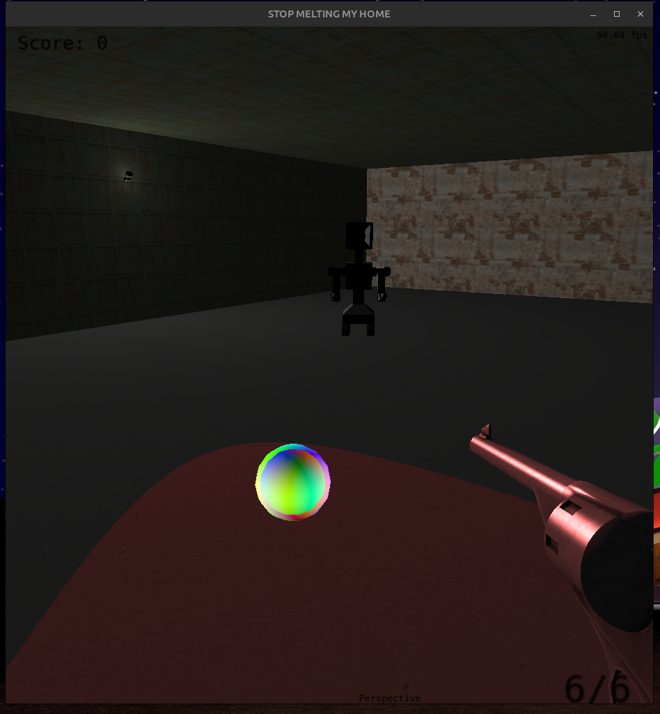
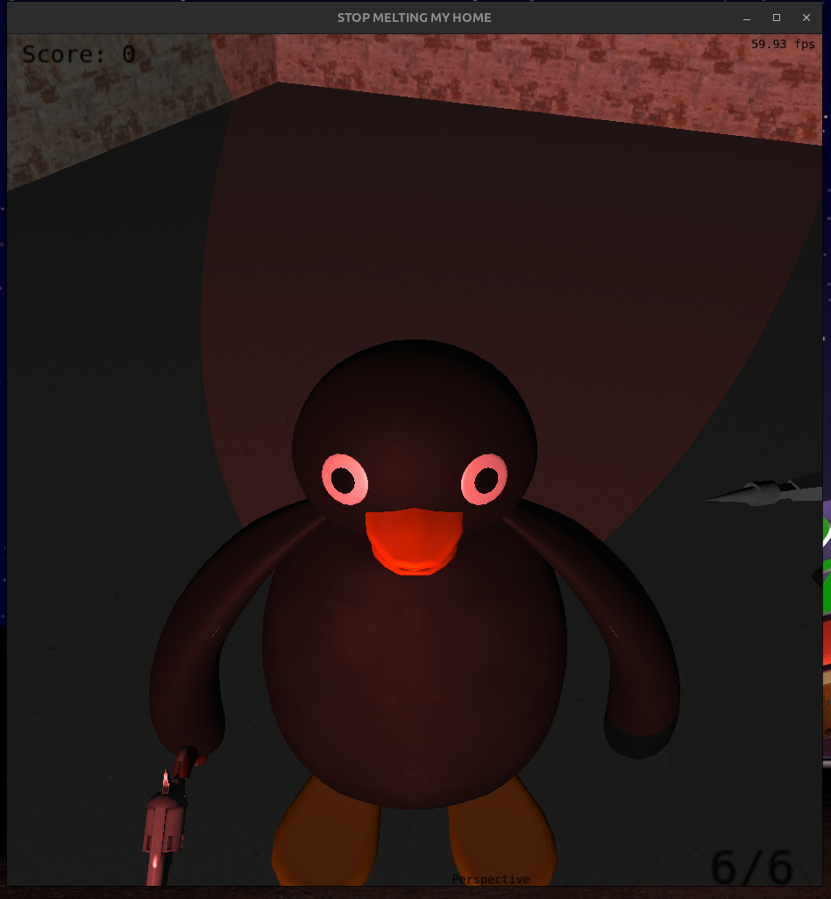
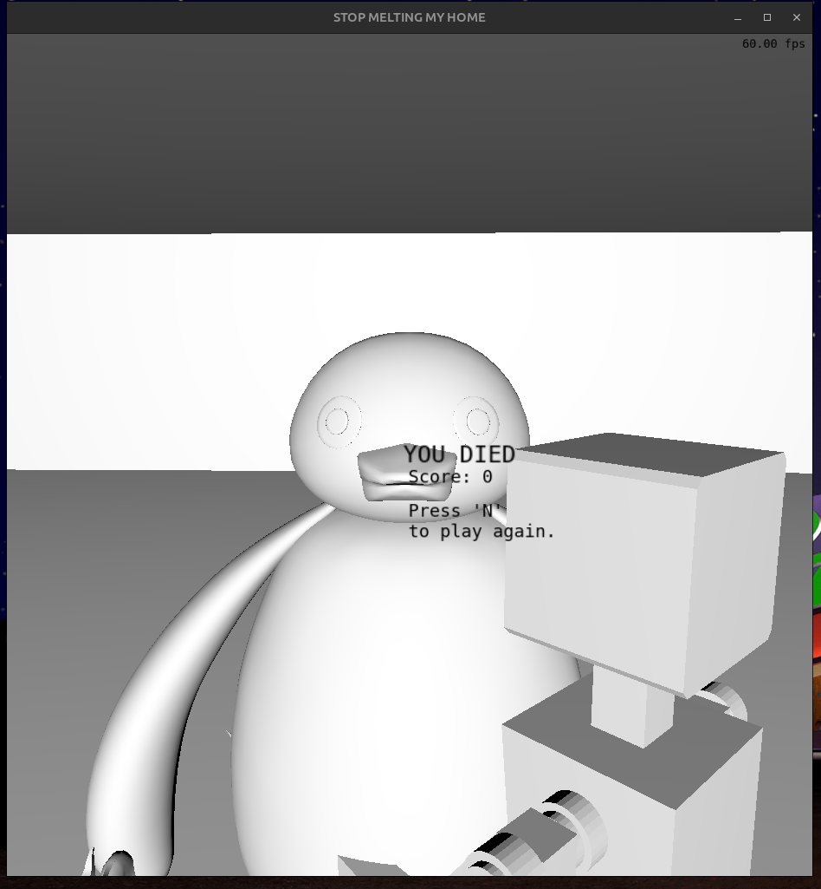

# OpenlGL FPS Game - Final Project for Fundamentals of Computer Graphics


This is the final project for the Fundamentals of Computer Graphics course (INF/UFRGS), developed by Joao Francisco and Mario Augusto.

**Application Description:**


## Team Members

* **Joao Francisco Hirtenkauf Munhoz** - 00275634
* **Mario Augusto Brum da Silveira** - 00322868


## Application Screenshots






## User Manual

### Game/Application Controls

| Key/Mouse          | Action                                           |
| ------------------ | ------------------------------------------------ |
| `W`, `A`, `S`, `D` | Move the main character/object.                  |
| `Mouse`            | Controls the camera's orientation.               |
| `Right Mouse`      | Aim/Zoom.                                        |
| `Left Mouse`       | Shot.                                            |
| `C`                | Switch between camera types (Look-at / Free).    |
| `K`                | Start enemies spawn.                             |
| `J`                | Stop enemies spawn.                              |
| `N`                | Restart the game.                                |
| `Esc`              | Close the application.                          |


## Development Process

The technologies chosen for the project were C++, OpenGL, GLFW, glad, glm and the tiny object loader library. For version control git and GitHub were used.
During the project, we studied and implemented fundamental computer graphics concepts, including real-time rendering with OpenGL, movement based on time, interpolation and illumination models implemented in vertex and fragment shaders, movement based on Bézier curves and collision tests. We also handled texture mapping, and built 3D scenes with first and third-person camera control.

### Member Contributions

* **[João Francisco]:** Implemented the camera system, player movement, texturing for objects, the lighting models, interpolation models and other shader logic, rat movement with Bézier curves, loading of .obj models, logic of enemies and securirty camera and obtained the models form internet.
* **[Mario Augusto]:**  Point-sphere,Sphere-sphere, Plane-sphere collision detection ,designed the camera aiming system, and developed orb movement mechanics.

### Use of AI Tools

* Explaining concepts of Computer Graphics;
* Explaining details about the technologies being used;
* Creating base files for Player, Enemy and Camera;
* Debuging main loop and shaders;
* Loading .obj in tiny_obj_loader with multiple objects in one file;

### Analysis of AI Tools
The AI tools were OK for debugind obvious bugs and writing short specific code, like a for loop for loading object parts from a .obj. They were not so good, but also no horrible for making templates for the class files. The tools would just not work for more complex bugs, or if it was asked to write code which required understanding big parts of the project.


## Implementation of CG Concepts

Below, we detail how each technical requirement from the course was implemented in our application.

* **Complex Polygonal Meshes:**
    Complex models were used for Pingu, the gun, the robots and the security camera. All objects were loaded with tiny object loader.

* **Geometric Transformations:**
    Player movement controls geometric transformations of Pingu and the gun. Shooting and aiming also transforms the gun. Walking makes the security camera turn toward the position of the player.

* **Virtual Camera Control:**
    Two types of camera were implemented. Free camera was implemented as the first person camera centered in the player. A look-at camera was implemented centered in the player so that the model of Pingu can be observed.

* **Object Instancing:**
    The object of the robot was instaced multiple times, one for each enemy, which spawn in a decreasing time interval up to a max of 20 simultaneous enemies.

* **Intersection Tests:**
    Plane–sphere collision was implemented to delimit the game walls. Point–sphere collision was used to detect when the player's shot hit enemies, and sphere–sphere collision was used for the interaction between the player and the orb, allowing the player to recharge bullets and gain movement speed.

* **Lighting Models (Diffuse and Blinn-Phong):**
    Pingu and the gun use the Blinn-Phong lighting model. All other objects (besides the sphere which has a procedural logic independent of light sources) use Diffuse model.

* **Interpolation Models (Gouraud and Phong):**
    The robots, the rat and the security camera use the Gouraud interpolation model. All other objects use the Phong interpolation model.

* **Texture Mapping:**
    All objects have textures without distortion. The sphere has a procedural texture, the robots have texture based only on colors for each part of the robot. All other objects have textures based on images.
 
* **Bézier Curves:**
    The rat moves based on a cubic Bézier curve with each point located at one corner of the map.

* **Time-Based Animation:**
    All movement(player, enemies, orb) is based on delta time which is the time elapsed since the last frame. This makes the game works the same in different computers.


## Building and Running

### Dependencies
To build and run this project, you will need:
* g++
* make

### Build Steps

**Linux:**
```bash
# From the root folder
make run
```

### Execution

After building, the executable will be in the `bin/Linux` folder. To run:

**Linux:**
```bash
# From the root folder
cd bin/Linux
./main
```

## Presentation Video

You can watch a demonstration of our application on YouTube:

**[Demonstration Video](https://www.youtube.com/watch?v=LA_4Fbr0zuE)**
